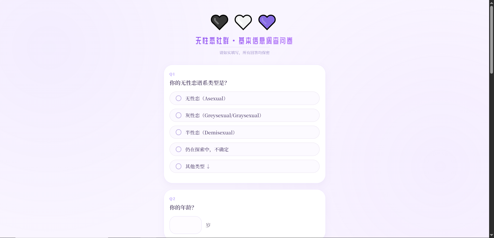

# AceSurvey

  

  <strong>AceSurvey</strong> 
  面向无性恋社群的问卷与卡片生成工具

## 项目简介

AceSurvey 是一个面向无性恋社群的静态问卷工具，用于填写基础信息、梳理自我经验，并生成适合保存或分享的问卷卡片。

项目供访问者自助填写问卷、生成问卷卡片，并按需保存或分享。

## 功能概览

- 问卷填写：提供分组题项，覆盖无性恋谱系身份、发现经历、相关认知、性行为态度与社群期待等内容。
- 草稿保存：填写内容会保存在当前浏览器中，刷新或重新打开页面后可继续编辑。
- 卡片预览：填写过程中可查看问卷卡片效果，方便在导出前调整内容。
- 图片导出：可将完整问卷导出为 PNG 图片，便于个人留存或按需分享。
- 移动适配：针对手机浏览器和常见内置浏览器优化了输入、滚动、预览与保存体验。

## 界面预览

  

## 使用方式

### 在线访问

访问 <https://acesurvey.pages.dev/>。

### 本地使用

直接用浏览器打开 [index.html](./index.html)。

## 隐私与数据

- 问卷内容保存在当前浏览器本地，不会由本项目上传到远程服务器。
- 更换浏览器、清理站点数据或使用无痕模式，可能导致本地草稿不可恢复。
- 导出的图片由访问者自行保存、转发或删除；公开分享前请确认其中不包含不愿公开的个人信息。

## 内容边界

- 本项目内容仅供社群问卷填写、自我梳理和身份表达辅助，不构成医疗、心理、法律或其他专业建议。
- 页面中的问题设置不代表对任何身份、立场或经历的诊断、评估或价值判断。
- 不同访问者可以根据自己的语境理解和填写问卷；无需把题项视为固定分类或标准答案。

## 许可协议

本项目依据 [MIT License](./LICENSE) 发布。

第三方资源以其原作者或原项目的许可证声明为准。

## 反馈与贡献

欢迎通过 [GitHub Issue](https://github.com/KrelinnBios/AceSurvey/issues) 提交错别字、排版兼容问题、问卷表述建议、移动端适配问题或图片导出问题。
